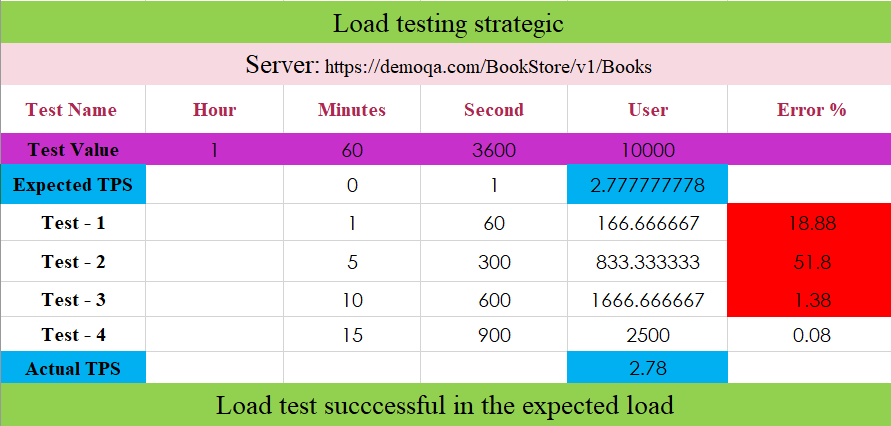
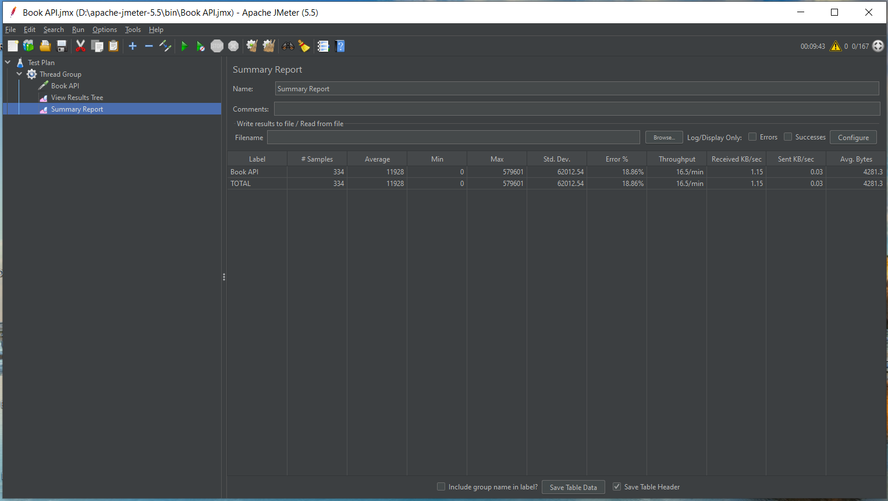
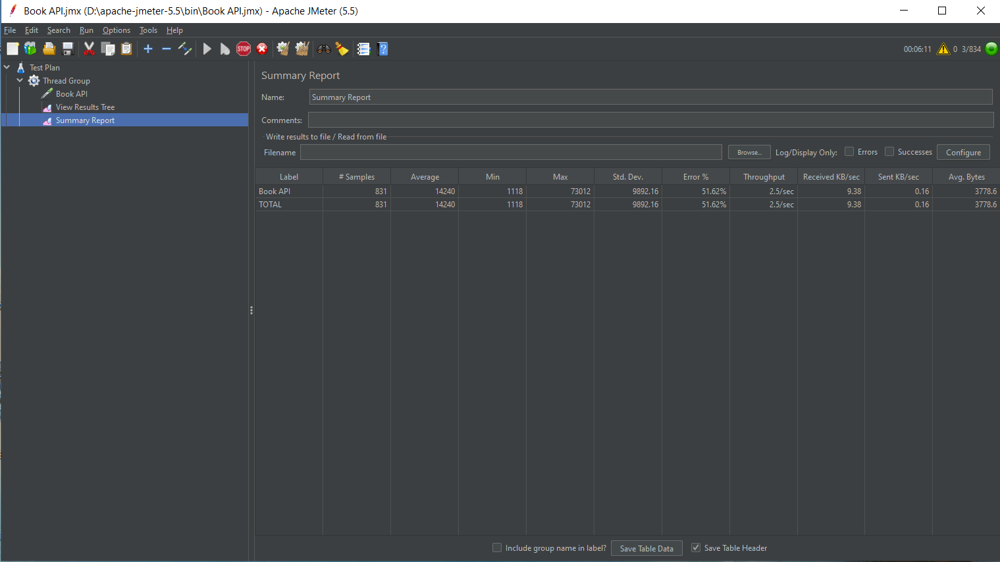
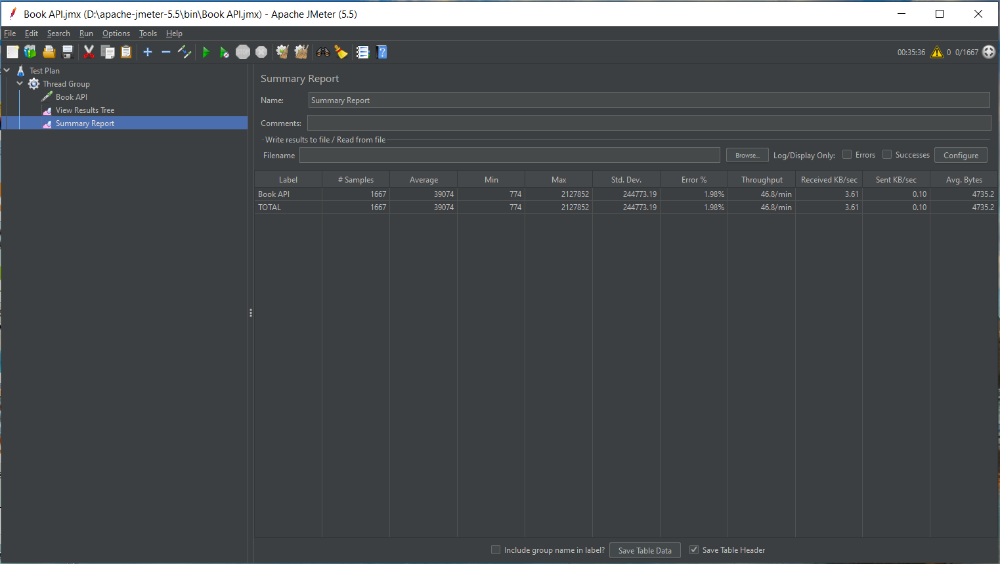
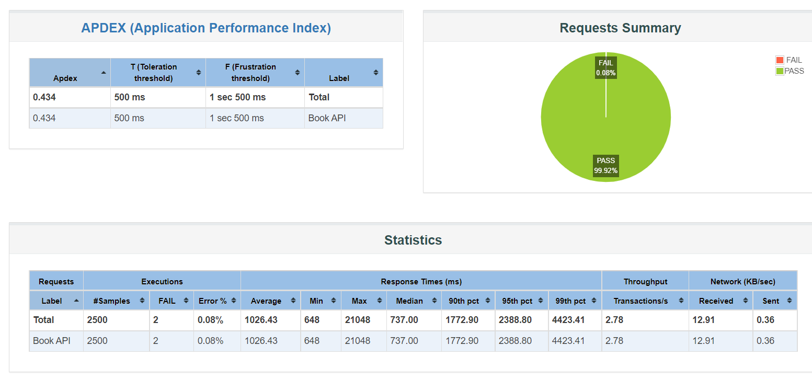

<h1 align="center">Book-API-Load-Test by Jmeter</h1>
:eight_spoked_asterisk: *Question*

- [x] Find out the actual TPS for if 10000 user can give load within 1 hour **Expected load:** 10000 user, per hour.
- [x] **Actual load:** what TPS? Breakdown the expected TPS in excel sheet and find out the actual TPS.
- [x] For 60s, 300s and 600s load, add Jmeter UI screenshot and for 900s generate html report and take screenshot.

##### **Solved**

#### :link: [**Excel and Word Report**](https://github.com/Tonmoy61/Book-API-Load-Test/tree/main/resources)

#### :diamond_shape_with_a_dot_inside: **Load Test Strategy**

#### :link: [Server](https://demoqa.com/BookStore/v1/Books)

|  |
| :------------------------------------: |
|              _Actual TPS_              |

#### :diamond_shape_with_a_dot_inside: **JMeter Summary Report**

:small_blue_diamond: 167 users for 60 seconds

|  |
| :----------------------------------:|
|         _60 sec, 167 users_         |

:small_blue_diamond: 833 users for 300 seconds

|  |
| :----------------------------------:|
|         _300 sec, 833 users_        |

:small_blue_diamond: 1667 users for 600 seconds

|  |
| :----------------------------------:|
|        _600 sec, 1666 users_        |

:small_blue_diamond: Test Summary Report - 2500 users for 950 seconds

|  |
| :------------------------------------------:|
|               _Summary Report_              |
